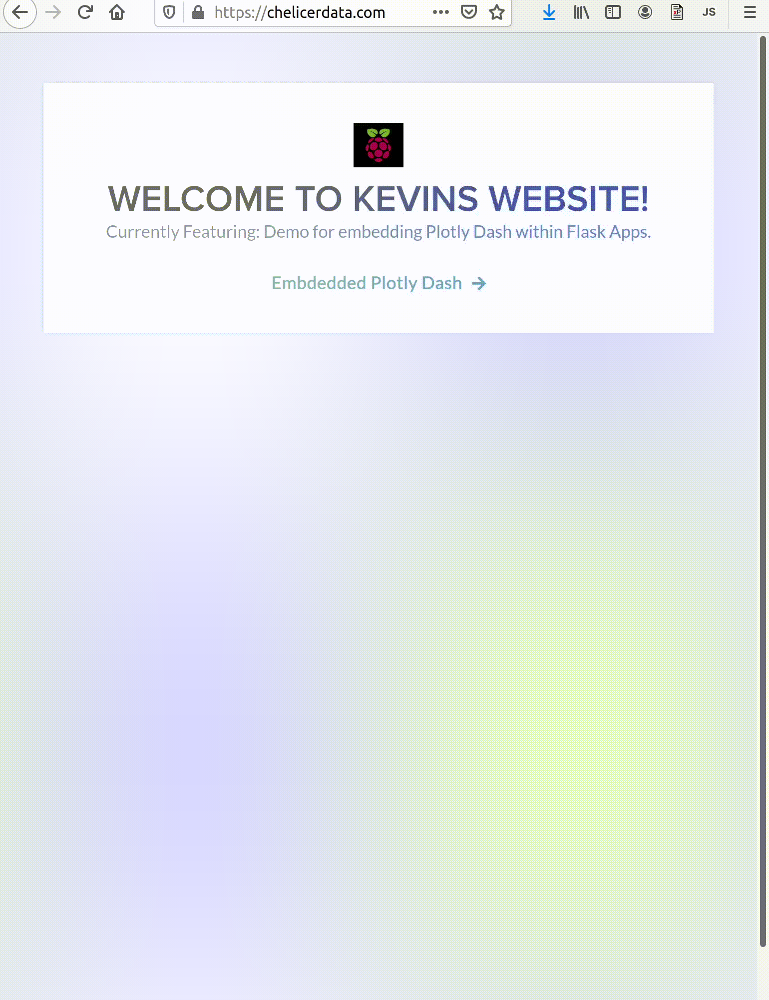

	<h1 style="text-align: center">
		Kevin Zehnder Home</h1>
  		<h4 style="text-align: center">
		Visit my website: 
	<a href="https://chelicerdata.com/" title="Personal Website">chelicerdata.com</a>
	 
		View Resume:
	<a href="https://github.com/righttrianglesrkewl3/job/blob/main/docs/imgs/KEVIN_ZEHNDER_jan2021_u_git.pdf" title="Resume">Resume</a> 
		</h4>

  

Click to expand website demo

  

    <h1 style="text-align: center">Selected Projects</h1>
    <table>
        <tr>
            <th>thumbnail</th>
	    <th>title</th>
            <th>description</th>
            <th>code</th>
        </tr>
	<tr>
		<td></td>
                <td>Flask-uSWGI-NGINX-Ubuntu</td>
                <td>Serving Flask applications with uWSGI and NGINX on Ubuntu 20</td>
                <td>https://github.com/righttrianglesrkewl3/job/tree/main/flask-nginx-uwsgi-digital-ocean-webhost</td>
            </tr>
	    <tr>
	    <td></td>
	    <td>Plotly-Dash Dashboard SP500 Stocks</td>
	    <td>SP500 Plotly-Dash App Simple</td>
	    <td>https://github.com/righttrianglesrkewl3/job/tree/main/plotlydash-sp500/</td>
	    <tr>
                <td></td>
                <td>Tensorflow Object Detection Faster-RCNN</td>
                <td>Custom Object Detector (2 classes)</td>
                <td>https://github.com/righttrianglesrkewl3/job/tree/main/cv-sanitizer-detector</td>
            </tr>
	    <tr>
		<td></td>
                <td>Computer Vision Facial Recognition</td>
                <td>Identifying people wih labeled bounding boxes computer vision</td>
                <td>https://github.com/righttrianglesrkewl3/job/tree/main/cv-president-detector-face</td>
            </tr>
    </table>
